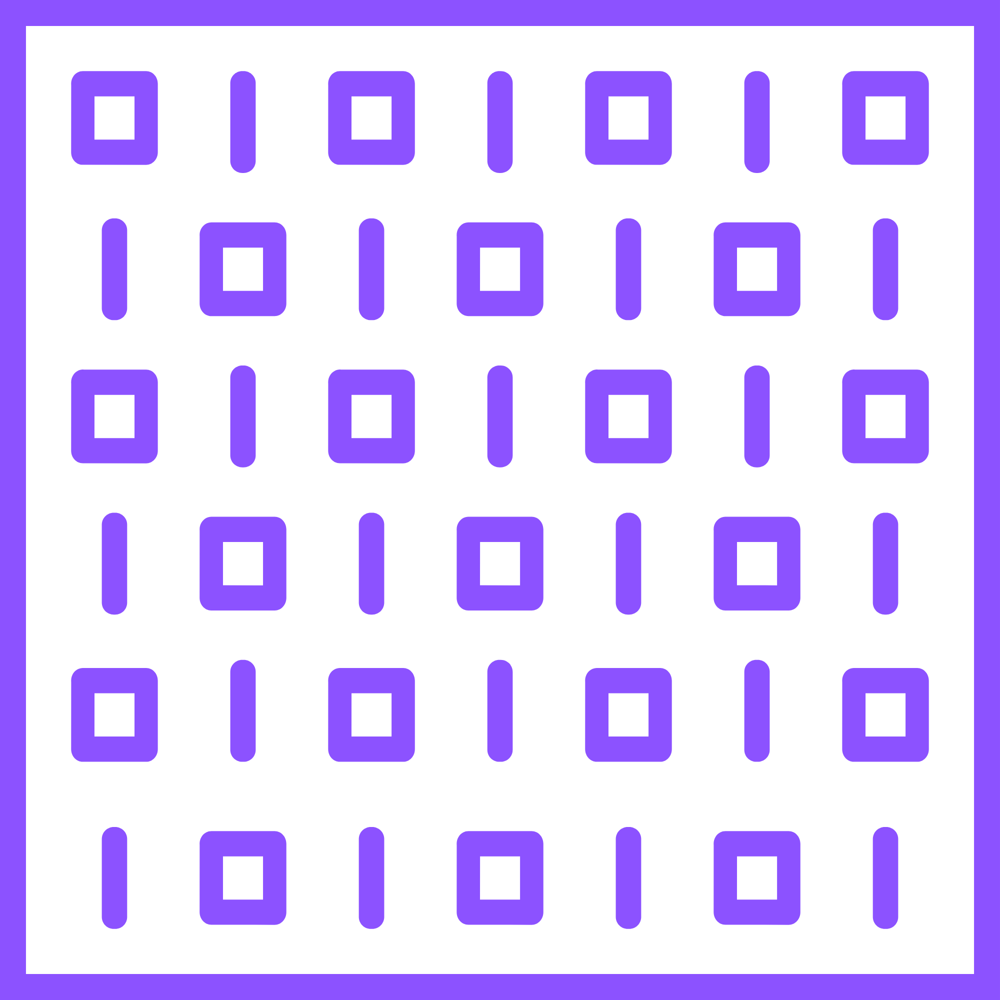

# JA-TUI

<p align="center">  </p>

JA-TUI is a small terminal UI tool for creating _web projects_ without having to type out the usual setup commands.

**NOTE :** _This was actually made for me, as I always spend a lot of time making my environment comfortable. Feel free to modify the entire project however you like, and let me know if any mistakes come up, ya._

It lets you choose:

- Project name
- Project directory
- Framework
- UI library

Then JA-TUI runs the required Bun commands for you.

## Supported

### Frameworks

- React + Vite
- Next.js
- Vue
- Svelte

### UI

- shadcn/ui
- Tailwind CSS
- Material UI
- None

## Built With

- TypeScript
- Bun
- OpenTUI

## How It Works

Start JA-TUI and enter a project name.

Choose where the project should be created using the Windows directory selector.

Then select your framework and UI library.

JA-TUI handles the setup and runs the commands inside the selected directory.

## Development

Install dependencies:

```bash
bun install
```

Run the project:

```bash
bun run src/main.ts
```

## Build

JA-TUI can be built as a Windows executable.

```powershell
.\build.ps1
```

The build creates:

```text
release/
├── JA-TUI.exe
└── runtime/
    └── bun.exe
```

The bundled Bun runtime allows JA-TUI to run its project setup commands without requiring the user to have Bun installed separately.

## Windows

JA-TUI currently targets Windows.

The directory picker uses the Windows folder selection dialog, and the release includes its own Bun runtime.

## Status

Early development.

Things are still being added and changed.

## License

MIT, Apache 2.0, BSD


<p>with &#9825; from CIN</p>